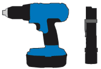

= 追加の機器や工具の入手（ SG5700 ）
:allow-uri-read: 
:icons: font
:imagesdir: ../media/

[role="lead"]
StorageGRID アプライアンスを設置する前に、必要な追加機器や工具がすべて揃っていることを確認します。

ハードウェアの設置と設定を行うには、次の追加機器が必要です。

* * ドライバ *
+
image::../media/screwdrivers.gif[2 本のドライバ]

+
フィリップス番号2 本のドライバ

+
中型マイナスドライバ

* * 静電気防止用リストストラップ *
+
image::../media/appliance_wriststrap.gif[静電気防止用リストストラップ]

* * 光ケーブルと SFP トランシーバ *
+
image::../media/fc_cable_and_sfp.gif[光ケーブルと SFP+ トランシーバ]

+
使用する 10 / 25GbE ポート用の光ケーブル

+
オプション： 25GbE のリンク速度を使用する場合は、 SFP28 トランシーバを搭載します

* * イーサネットケーブル *
+
image::../media/ethernet_cables.png[イーサネットケーブル]

* * サービスラップトップ *
+
image::../media/sam_management_client.gif[サービスラップトップ]

+
xref:../admin/web-browser-requirements.adoc[サポートされている Web ブラウザ]

+
PuTTY などの SSH クライアント

+
1Gb （ RJ-45 ）イーサネットポート

* * オプションのツール *
+

+
ヘッドビット付き電源ドリル

+
懐中電灯

+
SG5760 のリフト機械化

