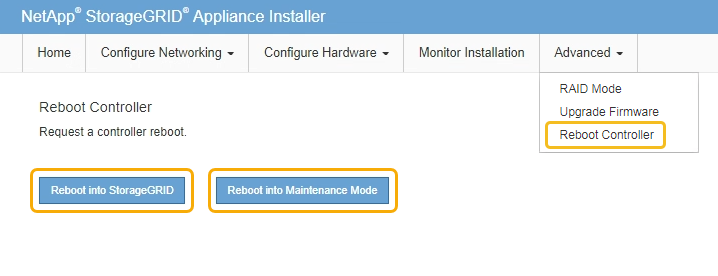

= E2800 コントローラを交換
:allow-uri-read: 
:icons: font
:imagesdir: ../media/

[role="lead"]
E2800 コントローラが適切に機能しない場合や障害が発生した場合は、交換が必要となることがあります。

.このタスクについて
* 交換するコントローラと同じパーツ番号の交換用コントローラを用意しておきます。
* 障害が発生した E2800 コントローラキャニスターのシンプレックス構成を交換するための手順書をダウンロードしておきます。
+

IMPORTANT: E シリーズの手順書は、指示された場合、または特定の手順の詳細を知る必要がある場合にのみ参照してください。StorageGRID アプライアンスのコントローラを交換する際は、 E シリーズの手順書を参考にしないでください。手順が異なります。

* コントローラに接続する各ケーブルを識別するためのラベルを用意しておきます。
* すべてのドライブがセキュリティ保護されている場合は、シンプレックス E2800 コントローラ交換手順 の手順を確認します。これには、ネットアップサポートサイトから E シリーズ SANtricity Storage Manager をダウンロードしてインストールし、コントローラの交換後に Enterprise Management Window （ EMW ）を使用してセキュリティ保護されたドライブのロックを解除する作業が含まれます。
+

IMPORTANT: 保存されたキーでドライブのロックを解除するまでは、アプライアンスを使用できません。

* 特定のアクセス権限が必要です。
* を使用して Grid Manager にサインインする必要があります xref:../admin/web-browser-requirements.adoc[サポートされている Web ブラウザ]。

コントローラキャニスターに障害が発生したかどうかは、次の 2 つの方法で確認できます。

* SANtricity System Manager の Recovery Guru から、コントローラを交換するように指示されます。
* コントローラの黄色の警告 LED が点灯して、コントローラに障害が発生したことが通知されます。

コントローラを交換すると、アプライアンスストレージノードにアクセスできなくなります。E2800 コントローラが問題なく機能している場合は、を実行できます xref:placing-appliance-into-maintenance-mode.adoc[E5700SG コントローラをメンテナンスモードにしてください]。

コントローラを交換するときは、元のコントローラからバッテリを取り外し、交換用コントローラに取り付ける必要があります。

NOTE: アプライアンス内の E2800 コントローラには、ホストインターフェイスカード（ HIC ）は搭載されていません。

.手順
. E2800 コントローラの交換用手順 の手順に従って、コントローラを取り外す準備をします。
+
これらの手順を実行するには、 SANtricity System Manager を使用します。

+
.. コントローラに現在インストールされている SANtricity OS ソフトウェアのバージョンを書き留めます。
.. 現在インストールされている NVSRAM のバージョンを書き留めます。
.. ドライブセキュリティ機能が有効になっている場合は、保存されたキーが存在すること、およびそのインストールに必要なパスフレーズを確認しておきます。
+

IMPORTANT: * データ・アクセスが失われる可能性 - * アプライアンスのすべてのドライブでセキュリティが有効になっている場合、 SANtricity ストレージ・マネージャの [ エンタープライズ管理 ] ウィンドウを使用してセキュリティ保護されたドライブのロックを解除するまで、新しいコントローラはアプライアンスにアクセスできません。

.. 構成データベースをバックアップします。
+
コントローラを取り外すときに問題が発生した場合は、保存したファイルを使用して構成をリストアできます。

.. アプライアンスのサポートデータを収集します。
+

NOTE: コンポーネントを交換する前後にサポートデータを収集しておけば、交換しても問題が解決しない場合に、テクニカルサポートにすべてのログを送信できます。

. StorageGRID アプライアンスを StorageGRID システムで実行している場合は、 xref:placing-appliance-into-maintenance-mode.adoc[E5700SG コントローラをメンテナンスモードにしてください]。
. E2800 コントローラが動作していて通常の方法でシャットダウンできる場合は、すべての処理が完了していることを確認します。
+
.. SANtricity システムマネージャのホームページで、「 * 進行中の処理を表示」を選択します。
.. すべての処理が完了したことを確認します。

. コントローラをアプライアンスから取り外します。
+
.. ESD リストバンドを装着するか、静電気防止処置を施します。
.. ケーブルにラベルを付け、ケーブルと SFP を外します。
+

IMPORTANT: パフォーマンスの低下を防ぐために、ケーブルをねじったり、折り曲げたり、はさんだり、踏みつけたりしないでください。

.. カムハンドルのラッチを押してコントローラをアプライアンスから外し、カムハンドルを右側に開きます。
.. 両手でカムハンドルをつかみ、コントローラをスライドしてアプライアンスから引き出します。
+

IMPORTANT: コントローラは重いので、必ず両手で支えながら作業してください。

.. 取り外し可能なカバーを上にして、静電気防止処置を施した平らな場所にコントローラを置きます。
.. カバーをボタンを押し下げながらスライドして取り外します。

. 障害が発生したコントローラからバッテリを取り外し、交換用コントローラに取り付けます。
+
.. コントローラ内部（バッテリと DIMM の間）の緑の LED が消灯していることを確認します。
+
この緑の LED が点灯している場合は、コントローラがまだバッテリ電源を使用しています。この LED が消灯するのを待ってから、コンポーネントを取り外す必要があります。

+
image::../media/e2800_internal_cache_active_led.gif[E2800 の緑色の LED]

+
|===
| 項目 | 説明 

 a| 
1.
 a| 
内部キャッシュアクティブ LED

 a| 
2.
 a| 
バッテリー

|===
.. バッテリの青色のリリースラッチの位置を確認します。
.. バッテリをリリースラッチを押し下げながら引き出し、コントローラから外します。
+
image::../media/e2800_remove_battery.gif[バッテリのラッチ]

+
|===
| 項目 | 説明 

 a| 
1.
 a| 
バッテリのリリースラッチ

 a| 
2.
 a| 
バッテリー

|===
.. バッテリを持ち上げながらスライドし、コントローラから引き出します。
.. 交換用コントローラのカバーを取り外します。
.. バッテリのスロットが手前になるよう交換用コントローラの向きを変えます。
.. バッテリを少し下に傾けながらコントローラに挿入します。
+
バッテリ前部の金属製のフランジをコントローラ下部のスロットに挿入し、バッテリの上部がコントローラの左側にある小さな位置決めピンの下にくるまでスライドする必要があります。

.. バッテリラッチを上に動かしてバッテリを固定します。
+
カチッという音がしてラッチが固定されると、ラッチの下部がシャーシの金属製のスロットに収まります。

.. コントローラを裏返し、バッテリが正しく取り付けられていることを確認します。
+

IMPORTANT: * ハードウェアの破損の可能性 * - バッテリ前部の金属製のフランジがコントローラのスロットにしっかりと挿入されている必要があります（ 1 つ目の図）。バッテリが正しく取り付けられていないと（ 2 つ目の図）、金属製のフランジがコントローラボードに接触し、破損の原因となる可能性があります。

+
*** * 正解 -- バッテリの金属製のフランジがコントローラのスロットに完全に挿入されています *
+
image::../media/e2800_battery_flange_ok.gif[バッテリのフランジが正常な状態]

*** * 不正解 -- バッテリの金属製のフランジがコントローラのスロットに挿入されていません *
+
image::../media/e2800_battery_flange_not_ok.gif[バッテリのフランジが正しくない状態]

.. コントローラカバーを取り付けます。

. 交換用コントローラをアプライアンスに取り付けます。
+
.. 取り外し可能なカバーが下になるようにコントローラを裏返します。
.. カムハンドルを開いた状態でコントローラをスライドし、アプライアンスに最後まで挿入します。
.. カムハンドルを左側に動かして、コントローラを所定の位置にロックします。
.. ケーブルと SFP を交換します。
.. E2800 コントローラがリブートするまで待ちます。デジタル表示ディスプレイに「 99 」の状態が表示されていることを確認します。
.. 交換用コントローラに IP アドレスを割り当てる方法を決定します。
+

NOTE: 交換用コントローラに IP アドレスを割り当てる手順は、管理ポート 1 を接続したネットワークに DHCP サーバがあるかどうか、またすべてのドライブがセキュリティ保護されているかどうかによって異なります。

+
*** 管理ポート 1 が DHCP サーバがあるネットワークに接続されている場合は、新しいコントローラの IP アドレスが DHCP サーバから取得されます。この値は、元のコントローラの IP アドレスと異なる場合があります。
*** すべてのドライブがセキュリティ保護されている場合は、 SANtricity Storage Manager の Enterprise Management Window （ EMW ）を使用して、セキュリティ保護されたドライブのロックを解除する必要があります。保存されたキーでドライブのロックを解除するまでは、新しいコントローラにアクセスできません。シンプレックス E2800 コントローラの交換については、 E シリーズの手順書を参照してください。

. アプライアンスで使用されるドライブがセキュリティ保護されている場合は、 E2800 コントローラの交換用手順 の手順に従ってドライブセキュリティキーをインポートします。
. アプライアンスを通常の動作モードに戻します。StorageGRID アプライアンス・インストーラから、 *Advanced*>* Reboot Controller* を選択し、 * Reboot into StorageGRID * を選択します。
+

+
リブート中、次の画面が表示されます。

+
image::../media/reboot_controller_in_progress.png[リブートを実行中です]

+
アプライアンスがリブートし、グリッドに再度参加します。この処理には最大 20 分かかることがあります。

. リブートが完了し、ノードが再びグリッドに参加したことを確認します。Grid Manager で、ノードページにアプライアンスノードの正常なステータス（ノード名の左側にアイコンがない）が表示されていることを確認します。これは、アクティブなアラートがなく、ノードがグリッドに接続されていることを示します。
+
image::../media/node_rejoin_grid_confirmation.png[アプライアンスノードがグリッドに再参加しました]

. SANtricity System Manager で、新しいコントローラのステータスが「 Optimal 」であることを確認し、サポートデータを収集します。

http://mysupport.netapp.com/info/web/ECMP1658252.html["NetApp E シリーズシステムのドキュメントのサイト"^]
