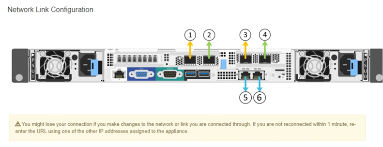

= ネットワークリンク（ SG6000 ）の設定
:icons: font
:imagesdir: ../media/

[role="lead"]
アプライアンスをグリッドネットワーク、クライアントネットワーク、および管理ネットワークに接続するために使用するポートのネットワークリンクを設定できます。リンク速度およびポートボンディングモードとネットワークボンディングモードを設定できます。

アプライアンスノードをクローニングする場合は、ソースアプライアンスノードで使用されるすべてのリンクについて、ターゲットアプライアンスのネットワークリンクを設定します。

25GbE のリンク速度を使用する場合は、次の要件があります。

* SFP28 TwinAx ケーブルを使用するか、使用するネットワークポートに SFP28 トランシーバを取り付けておきます。
* この速度をサポートするスイッチにネットワークポートを接続しておきます。
* この速度を使用するようにスイッチを設定する方法を理解しておきます。

アグリゲートポートボンディングモード、 LACP ネットワークボンディングモード、または VLAN タギングを使用する場合

* アプライアンスのネットワークポートを、 VLAN と LACP をサポートするスイッチに接続しておきます。
* 複数のスイッチを LACP ボンドに加える場合は、 Multi-Chassis Link Aggregation （ MLAG ）グループまたは同等の機能をサポートするスイッチを使用します。
* VLAN 、 LACP 、 MLAG などを使用するようにスイッチを設定する方法について理解しておく必要があります。
* 各ネットワークに使用する一意の VLAN タグを確認しておきます。この VLAN タグが各ネットワークパケットに追加され、ネットワークトラフィックが正しいネットワークにルーティングされます。

次の図では、 4 つのネットワークポートが Fixed ポートボンディングモードでボンディングされています（デフォルトの構成）。

image::../media/sg6000_cn_fixed_port.gif[SG6000-CN コントローラのネットワークポートが Fixed モードでボンディングされた状態を示す図]

[cols="1a,3a"]
|===
| コールアウト | ボンディングされるポート 

 a| 
C
 a| 
このネットワークを使用する場合、ポート 1 とポート 3 がクライアントネットワーク用にボンディングされます。

 a| 
G
 a| 
ポート 2 とポート 4 がグリッドネットワーク用にボンディングされます。

|===
次の図では、 4 つのネットワークポートが Aggregate ポートボンディングモードでボンディングされています。

image::../media/sg6000_cn_aggregate_port.gif[SG6000-CN コントローラのネットワークポートが Aggregate モードでボンディングされた状態を示す図]

[cols="1a,3a"]
|===
| コールアウト | ボンディングされるポート 

 a| 
1.
 a| 
4 つのポートすべてを 1 つの LACP ボンドにグループ化して、すべてのポートをグリッドネットワークとクライアントネットワークのトラフィックに使用できるようにします。

|===
次の表に、 4 つのネットワークポートを設定するためのオプションをまとめます。デフォルトの設定は太字で示しています。デフォルト以外の設定を使用する場合にのみ、 Link Configuration ページで設定を行う必要があります。

* * 固定（デフォルト）ポートボンディングモード *
+
[cols="1a,3a,3a"]
|===
| ネットワークボンディングモード | クライアントネットワークが無効な場合（デフォルト） | クライアントネットワークが有効になりました 

 a| 
Active-Backup （デフォルト）
 a| 
** ポート 2 と 4 がグリッドネットワークにアクティブ / バックアップボンドを使用します。
** ポート 1 と 3 は使用されません。
** VLAN タグはオプションです。

 a| 
** ポート 2 と 4 がグリッドネットワークにアクティブ / バックアップボンドを使用します。
** ポート 1 と 3 がクライアントネットワークに Active-Backup ボンドを使用します。
** ネットワーク管理者用に、両方のネットワークに VLAN タグを指定できます。

 a| 
LACP （ 802.3ad ）
 a| 
** ポート 2 と 4 がグリッドネットワークに LACP ボンドを使用します。
** ポート 1 と 3 は使用されません。
** VLAN タグはオプションです。

 a| 
** ポート 2 と 4 がグリッドネットワークに LACP ボンドを使用します。
** ポート 1 と 3 がクライアントネットワークに LACP ボンドを使用します。
** ネットワーク管理者用に、両方のネットワークに VLAN タグを指定できます。

|===
* * アグリゲートポートボンディングモード *
+
[cols="1a,3a,3a"]
|===
| ネットワークボンディングモード | クライアントネットワークが無効な場合（デフォルト） | クライアントネットワークが有効になりました 

 a| 
LACP （ 802.3ad ）のみ
 a| 
** ポート 1~4 がグリッドネットワークに単一の LACP ボンドを使用します。
** 単一の VLAN タグでグリッドネットワークのパケットが識別されます。

 a| 
** ポート 1~4 がグリッドネットワークとクライアントネットワークに単一の LACP ボンドを使用します。
** 2 つの VLAN タグで、グリッドネットワークのパケットとクライアントネットワークのパケットを分離できます。

|===

を参照してください xref:port-bond-modes-for-sg6000-cn-controller.adoc[SG6000-CN コントローラのポートボンディングモード] ポートボンディングモードとネットワークボンディングモードの詳細については、を参照してください。

次の図では、 SG6000-CN コントローラの 2 つの 1GbE 管理ポートが管理ネットワーク用に Active-Backup ネットワークボンディングモードでボンディングされています。

image::../media/sg6000_cn_bonded_managemente_ports.gif[ボンディングされている管理ネットワークのポート]

.手順
. StorageGRID アプライアンスインストーラから、 *Configure Networking *>*Link Configuration* をクリックします。
+
Network Link Configuration ページには、アプライアンスの図と、ネットワークポートおよび管理ポートの番号が表示されます。

+

+
Link Status テーブルには、番号が付けられたポートのリンクステート（アップ / ダウン）と速度（ 1/10/25 / 40/100Gbps ）が表示されます。

+
image::../media/sg6060_configuring_network_linkstatus.png[リンクステータステーブル]

+
このページに初めてアクセスしたときの動作は次のとおりです。

+
** * リンク速度 * は * 自動 * に設定されています。
** * ポートボンディングモード * は「 * Fixed 」に設定されます。
** * グリッドネットワークの場合、ネットワークボンディングモード * が「アクティブ / バックアップ」に設定されます。
** 管理ネットワーク * が有効になっており、ネットワークボンディングモードが * Independent * に設定されています。
** クライアントネットワーク * が無効になっています。
+
image::../media/network_link_configuration_fixed.png[ネットワークリンク設定が修正されました]

. ネットワークポートに 25GbE のリンク速度を使用する場合は、リンク速度のドロップダウンリストから * Auto * を選択します。
+
グリッドネットワークとクライアントネットワークに使用するネットワークスイッチも、この速度をサポートし、この速度に対応するように設定する必要があります。また、 SFP28 TwinAx ケーブル、または光ケーブルと SFP28 トランシーバを使用する必要があります。

. 使用する StorageGRID ネットワークを有効または無効にします。
+
グリッドネットワークは必須です。このネットワークは無効にできません。

+
.. アプライアンスが管理ネットワークに接続されていない場合は、管理ネットワークの * ネットワークを有効にする * チェックボックスの選択を解除します。
+
image::../media/admin_network_disabled.gif[管理ネットワークを有効または無効にするチェックボックスを示すスクリーンショット]

.. アプライアンスがクライアントネットワークに接続されている場合は、クライアントネットワークの * ネットワークを有効にする * チェックボックスをオンにします。
+
これで、ネットワークポートでのクライアントネットワークの設定が表示されます。

. 表を参照して、ポートボンディングモードとネットワークボンディングモードを設定します。
+
次の例では、次のよう

+
** * グリッドネットワークとクライアントネットワークでアグリゲート * と * LACP * が選択されました。各ネットワークに一意の VLAN タグを指定する必要があります。値は 0~4095 の間で選択できます。
** * 管理ネットワーク用に選択されたアクティブ / バックアップ * 。
+
image::../media/network_link_configuration_aggregate.gif[アグリゲートモードのリンク設定を示すスクリーンショット]

. 選択に問題がなければ、 * 保存 * をクリックします。
+

NOTE: 接続しているネットワークまたはリンクを変更すると、接続が失われる可能性があります。1 分以内に再接続されない場合は、他のいずれかの URL を使用して StorageGRID アプライアンスインストーラの URL を再入力します xref:configuring-storagegrid-ip-addresses-sg6000.adoc[IP アドレス] アプライアンスに割り当てられています： https://_SG6000-CN_Controller_IP_:8443*`

