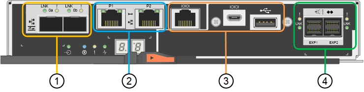

= SG6000 アプライアンスのコントローラ
:allow-uri-read: 
:icons: font
:imagesdir: ../media/

[role="lead"]
StorageGRID SG6000 アプライアンスの各モデルには、 1U エンクロージャに SG6000-CN コンピューティングコントローラが搭載され、 2U または 4U エンクロージャにデュプレックス E シリーズストレージコントローラが搭載されています。各タイプのコントローラの詳細については、次の図を確認してください。

== すべてのアプライアンス： SG6000-CN コンピューティングコントローラ

* アプライアンスのコンピューティングリソースを提供します。
* StorageGRID アプライアンスインストーラが搭載されています。
+

NOTE: StorageGRID ソフトウェアは、アプライアンスにプリインストールされていません。このソフトウェアは、アプライアンスの導入時に管理ノードから取得されます。

* グリッドネットワーク、管理ネットワーク、クライアントネットワークを含む、 3 つの StorageGRID ネットワークすべてに接続できます。
* E シリーズストレージコントローラに接続し、イニシエータとして機能します。

次の図は、 SG6000-CN の背面にあるコネクタを示しています。

image::../media/sg6000_cn_rear_connectors.gif[SG6000-CN 背面のコネクタ]

|===
|  | ポート | を入力します | 使用 

 a| 
1.
 a| 
インターコネクトポート 1~4
 a| 
16Gb/s Fibre Channel （ FC ）、光ファイバ内蔵
 a| 
SG6000-CN コントローラを E2800 コントローラに接続（各 E2800 に 2 つの接続）します。

 a| 
2.
 a| 
ネットワークポート 1~4
 a| 
10GbE または 25GbE 。ケーブルまたは SFP トランシーバタイプ、スイッチ速度、および設定されたリンク速度に基づきます
 a| 
StorageGRID のグリッドネットワークおよびクライアントネットワークに接続します。

 a| 
3.
 a| 
BMC 管理ポート
 a| 
1GbE （ RJ-45 ）
 a| 
SG6000-CN のベースボード管理コントローラに接続します。

 a| 
4.
 a| 
診断とサポート用のポート
 a| 
* VGA
* シリアル、 115200 8-N-1
* USB

 a| 
テクニカルサポート専用です。

 a| 
5.
 a| 
管理ネットワークポート 1
 a| 
1GbE （ RJ-45 ）
 a| 
SG6000-CN を StorageGRID の管理ネットワークに接続します。

 a| 
6.
 a| 
管理ネットワークポート 2
 a| 
1GbE （ RJ-45 ）
 a| 
オプション：

* StorageGRID の管理ネットワークへの冗長接続を確保するには、管理ポート 1 とボンディングします。
* 一時的なローカルアクセス用（ IP 169.254.0.1 ）に空けておくことができます。
* DHCP によって割り当てられた IP アドレスを使用できない場合は、設置時の IP 設定にポート 2 を使用します。

|===

== SG6060 ： E2800 ストレージコントローラ

* 2 台のコントローラでフェイルオーバーに対応。
* ドライブ上のデータを格納。
* デュプレックス構成では標準の E シリーズコントローラとして機能。
* SANtricity OS ソフトウェア（コントローラファームウェア）を搭載。
* ストレージハードウェアの監視やアラートの管理、 AutoSupport 機能、ドライブセキュリティ機能に対応した SANtricity System Manager が搭載されています。
* SG6000-CN コントローラに接続して、ストレージへのアクセスを提供します。

次の図は、各 E2800 コントローラ背面のコネクタを示しています。

|===
|  | ポート | を入力します | 使用 

 a| 
1.
 a| 
インターコネクトポート 1 と 2
 a| 
16Gb/s FC 光ファイバ SFPA
| 各 E2800 コントローラを SG6000-CN コントローラに接続します。SG6000-CN コントローラへの接続は 4 つ（各 E2800 に 2 つ）あります。 

 a| 
2.
 a| 
管理ポート 1 と 2
 a| 
1Gb （ RJ-45 ）イーサネット
 a| 
* ポート 1 のオプション：
+
** 管理ネットワークに接続して、 SANtricity System Manager に TCP/IP で直接アクセスできるようにします
** スイッチポートと IP アドレスを保存する場合は、有線を使用しないでください。SANtricity System Manager には、グリッドマネージャまたはストレージグリッドアプライアンスインストーラの UI を使用してアクセスします。

* 注 * ：正確なログタイムスタンプのための NTP 同期など、オプションの SANtricity 機能の一部は、ポート 1 を有線接続しないままにする場合は使用できません。

* 注：ポート 1 を有線接続しない場合は、 StorageGRID 11.5 以降および SANtricity 11.70 以降が必要です。

* ポート 2 はテクニカルサポート専用です。

 a| 
3.
 a| 
診断とサポート用のポート
 a| 
* RJ-45 シリアルポート
* マイクロ USB シリアルポート
* USB ポート

 a| 
テクニカルサポート専用です。

 a| 
4.
 a| 
ドライブ拡張ポート 1 と 2
 a| 
12Gb/ 秒 SAS の場合
 a| 
拡張シェルフの IOM のドライブ拡張ポートに接続します。

|===

== SGF6024 ： EF570 ストレージコントローラ

* 2 台のコントローラでフェイルオーバーに対応。
* ドライブ上のデータを格納。
* デュプレックス構成では標準の E シリーズコントローラとして機能。
* SANtricity OS ソフトウェア（コントローラファームウェア）を搭載。
* ストレージハードウェアの監視やアラートの管理、 AutoSupport 機能、ドライブセキュリティ機能に対応した SANtricity System Manager が搭載されています。
* SG6000-CN コントローラに接続して、フラッシュストレージへのアクセスを提供します。

次の図は、各 EF570 コントローラ背面のコネクタを示しています。

image::../media/ef570_rear_connectors.gif[EF570 の背面コネクタ]

|===
|  | ポート | を入力します | 使用 

 a| 
1.
 a| 
インターコネクトポート 1 と 2
 a| 
16Gb/s FC 光ファイバ SFPA
| 各 EF570 コントローラを SG6000-CN コントローラに接続します。SG6000-CN コントローラへの接続は 4 つ（各 EF570 から 2 つ）あります。 

 a| 
2.
 a| 
診断とサポート用のポート
 a| 
* RJ-45 シリアルポート
* マイクロ USB シリアルポート
* USB ポート

 a| 
テクニカルサポート専用です。

 a| 
3.
 a| 
ドライブ拡張ポート
 a| 
12Gb/ 秒 SAS の場合
 a| 
使用されません。SGF6024 アプライアンスでは、拡張ドライブシェルフはサポートされません。

 a| 
4.
 a| 
管理ポート 1 と 2
 a| 
1Gb （ RJ-45 ）イーサネット
 a| 
* ポート 1 は、ブラウザから SANtricity System Manager にアクセスするネットワークに接続します。
* ポート 2 はテクニカルサポート専用です。

|===

== SG6060 ：オプションの拡張シェルフの入力 / 出力モジュール

拡張シェルフには、ストレージコントローラまたはその他の拡張シェルフに接続する入出力モジュール（ IOM ）が 2 台搭載されています。

image::../media/iom_connectors.gif[背面の IOM]

|===
|  | ポート | を入力します | 使用 

 a| 
1.
 a| 
ドライブ拡張ポート 1~4
 a| 
12Gb/ 秒 SAS の場合
 a| 
各ポートをストレージコントローラまたは追加の拡張シェルフ（ある場合）に接続します。

|===