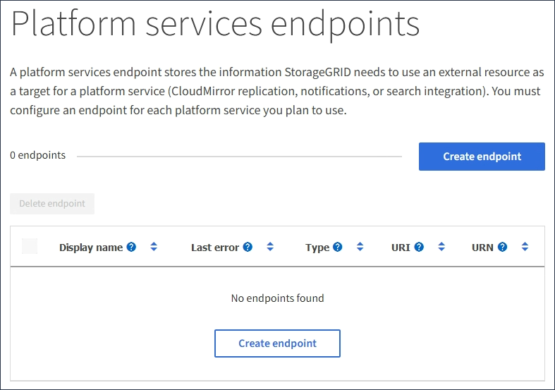
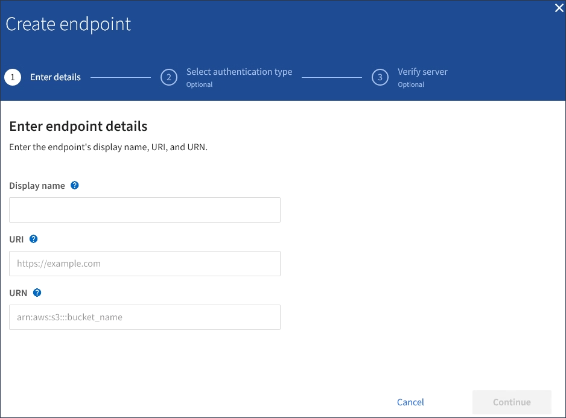

= プラットフォームサービスエンドポイントを作成します
:icons: font
:imagesdir: ../media/

[role="lead"]
プラットフォームサービスを有効にする前に、正しいタイプのエンドポイントを少なくとも 1 つ作成しておく必要があります。

.必要なもの
* Tenant Manager にはを使用してサインインする必要があります xref:../admin/web-browser-requirements.adoc[サポートされている Web ブラウザ]。
* テナントアカウントのプラットフォームサービスが StorageGRID 管理者によって有効化されている必要があります。
* Manage Endpoints 権限のあるユーザグループに属している必要があります。
* プラットフォームサービスエンドポイントによって参照されるリソースを作成しておく必要があります。
+
** CloudMirror レプリケーション： S3 バケット
** イベント通知： SNS トピック
** 検索通知：インデックスを自動的に作成するようにデスティネーションクラスタが設定されていない場合、 Elasticsearch インデックス。

* デスティネーションリソースに関する情報を確認しておく必要があります。
+
** Uniform Resource Identifier （ URI ）のホストとポート
+

NOTE: StorageGRID システムでホストされているバケットを CloudMirror レプリケーションのエンドポイントとして使用する場合は、グリッド管理者に問い合わせて入力が必要な値を決定してください。

** Unique Resource Name （ URN ）
+
xref:specifying-urn-for-platform-services-endpoint.adoc[プラットフォームサービスのエンドポイントの URN を指定してください]

** 認証クレデンシャル（必要な場合）：
+
*** Access Key ：アクセスキー ID とシークレットアクセスキー
*** 基本 HTTP 認証：ユーザ名とパスワード
*** CAP （ C2S Access Portal ）：一時的なクレデンシャル URL 、サーバ証明書とクライアント証明書、クライアントキー、およびオプションのクライアント秘密鍵パスフレーズ。

** セキュリティ証明書（カスタム CA 証明書を使用する場合）

.手順
. ストレージ（ S3 ） * > * プラットフォームサービスのエンドポイント * を選択します。
+
プラットフォームサービスエンドポイントページが表示されます。

+

. [ * エンドポイントの作成 * ] を選択します。
+

. エンドポイントとその目的を簡単に説明する表示名を入力します。
+
エンドポイントがサポートするプラットフォームサービスのタイプは、エンドポイントページでその情報を表示するときにエンドポイント名の横に表示されるため、名前にその情報を含める必要はありません。

. [* URI*] フィールドに、エンドポイントの Unique Resource Identifier （ URI ）を指定します。
+
次のいずれかの形式を使用します。

+
[listing]
----
https://host:port
http://host:port
----
+
ポートを指定しない場合、 HTTPS URI にはポート 443 が、 HTTP URI にはポート 80 が使用されます。

+
たとえば、 StorageGRID でホストされているバケットの URI は次のようになります。

+
[listing]
----
https://s3.example.com:10443
----
+
この例では、「 s3.example.com 」は StorageGRID ハイアベイラビリティ（ HA ）グループの仮想 IP （ VIP ）の DNS エントリを表し、「 10443 」はロードバランサエンドポイントで定義されたポートを表します。

+

NOTE: 単一点障害を回避するには、できるだけ負荷分散ノードの HA グループに接続する必要があります。

+
同様に、 AWS でホストされているバケットの URI は次のようになります。

+
[listing]
----
https://s3-aws-region.amazonaws.com
----
+

NOTE: エンドポイントが CloudMirror レプリケーションサービスで使用される場合は、 URI にバケット名を含めないでください。バケット名は「 * URN * 」フィールドに含める必要があります。

. エンドポイントの Unique Resource Name （ URN ）を入力します。
+

NOTE: エンドポイントの作成後に、エンドポイントの URN を変更することはできません。

. 「 * Continue * 」を選択します。
. 「 * 認証タイプ」の値を選択し、必要なクレデンシャルを入力またはアップロードします。
+
image::../media/endpoint_create_authentication_type.png[エンドポイント認証タイプを作成します]

+
指定するクレデンシャルには、デスティネーションリソースに対する書き込み権限が必要です。

+
[cols="1a,2a,2a"]
|===
| 認証タイプ | 説明 | クレデンシャル 

 a| 
匿名
 a| 
デスティネーションへの匿名アクセスを許可します。セキュリティが無効になっているエンドポイントでのみ機能します。
 a| 
認証なし。

 a| 
アクセスキー
 a| 
AWS 形式のクレデンシャルを使用してデスティネーションとの接続を認証します。
 a| 
** アクセスキー ID
** シークレットアクセスキー

 a| 
基本 HTTP
 a| 
ユーザ名とパスワードを使用して、デスティネーションへの接続を認証します。
 a| 
** ユーザ名
** パスワード

 a| 
CAP （ C2S Access Portal ）
 a| 
証明書とキーを使用してデスティネーションへの接続を認証します。
 a| 
** 一時的な資格情報 URL
** サーバ CA 証明書（ PEM ファイルのアップロード）
** クライアント証明書（ PEM ファイルのアップロード）
** クライアント秘密鍵（ PEM ファイルのアップロード、 OpenSSL 暗号化形式、または暗号化されていない秘密鍵形式）
** クライアント秘密鍵のパスフレーズ（オプション）

|===
. 「 * Continue * 」を選択します。
. Verify server * のラジオボタンを選択して、エンドポイントへの TLS 接続の検証方法を選択します。
+
image::../media/endpoint_create_verify_server.png[エンドポイントの作成 - 証明書の検証]

+
[cols="1a,2a"]
|===
| 証明書検証のタイプ | 説明 

 a| 
カスタム CA 証明書を使用する
 a| 
カスタムのセキュリティ証明書を使用します。この設定を選択した場合は、カスタムセキュリティ証明書を * CA 証明書 * テキストボックスにコピーして貼り付けます。

 a| 
オペレーティングシステムの CA 証明書を使用します
 a| 
オペレーティングシステムにインストールされているデフォルトの Grid CA 証明書を使用して接続を保護します。

 a| 
証明書を検証しないでください
 a| 
TLS 接続に使用される証明書は検証されません。このオプションはセキュアではありません。

|===
. [ * テストとエンドポイントの作成 * ] を選択します。
+
** 指定したクレデンシャルを使用してエンドポイントにアクセスできた場合は、成功を伝えるメッセージが表示されます。エンドポイントへの接続は、各サイトの 1 つのノードから検証されます。
** エンドポイントの検証が失敗した場合は、エラーメッセージが表示されます。エラーを修正するためにエンドポイントを変更する必要がある場合は、 * エンドポイントの詳細に戻る * を選択して情報を更新します。次に、「 * Test 」を選択し、エンドポイントを作成します。 *
+

NOTE: テナントアカウントでプラットフォームサービスが有効でない場合は、エンドポイントの作成が失敗します。StorageGRID 管理者にお問い合わせください。

エンドポイントの設定が完了したら、その URN を使用してプラットフォームサービスを設定できます。

xref:specifying-urn-for-platform-services-endpoint.adoc[プラットフォームサービスのエンドポイントの URN を指定してください]

xref:configuring-cloudmirror-replication.adoc[CloudMirror レプリケーションを設定します]

xref:configuring-event-notifications.adoc[イベント通知を設定する]

xref:configuring-search-integration-service.adoc[検索統合サービスを設定する]
