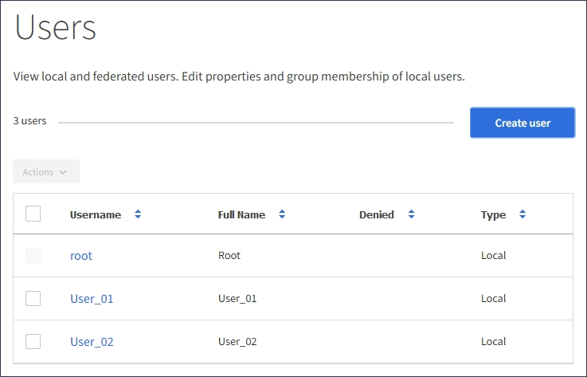

= ローカルユーザを管理します
:icons: font
:imagesdir: ../media/

[role="lead"]
ローカルユーザを作成してローカルグループに割り当て、ユーザがアクセスできる機能を決定することができます。Tenant Manager には、「 root 」という名前の事前定義されたローカルユーザが 1 つ含まれています。 ローカルユーザは追加および削除できますが、 root ユーザを削除することはできません。

.必要なもの
* Tenant Manager にはを使用してサインインする必要があります xref:../admin/web-browser-requirements.adoc[サポートされている Web ブラウザ]。
* Root Access 権限が設定された読み取り / 書き込みユーザグループに属している必要があります。を参照してください xref:tenant-management-permissions.adoc[テナント管理権限]。

NOTE: StorageGRID システムでシングルサインオン（ SSO ）が有効になっている場合、ローカルユーザはテナントマネージャまたはテナント管理 API にサインインできません。ただし、グループの権限に基づいて、 S3 または Swift クライアントアプリケーションを使用してテナントのリソースにアクセスすることはできます。

== ユーザページにアクセスします

アクセス管理 * > * Users * を選択します。

== ローカルユーザを作成する

ローカルユーザを作成して 1 つ以上のローカルグループに割り当て、ユーザのアクセス権限を制御することができます。

いずれのグループにも属していない S3 ユーザには、管理権限または S3 グループポリシーが適用されません。これらのユーザは、バケットポリシーを通じて S3 バケットアクセスを許可されている場合があります。

グループに属していない Swift ユーザには、管理権限または Swift コンテナへのアクセスは付与されません。

.手順
. 「 * ユーザーの作成 * 」を選択します。
. 次のフィールドに値を入力します。
+
** * フルネーム * ：このユーザのフルネーム。たとえば、ユーザの名と姓、またはアプリケーションの名前です。
** * ユーザ名 * ：このユーザがサインインに使用する名前。ユーザ名は一意である必要があり、変更できません。
** * Password * ：ユーザがサインイン時に使用するパスワード。
** * パスワードの確認 * ： [ パスワード ] フィールドに入力したパスワードと同じパスワードを入力します。
** * アクセスを拒否 * ：「 * はい」を選択した場合、このユーザはテナントアカウントにサインインできません。これは、ユーザがまだ 1 つ以上のグループに属している可能性がある場合も同様です。
+
たとえば、この機能を使用すると、ユーザが一時的にサインインできないようにすることができます。

. 「 * Continue * 」を選択します。
. 1 つ以上のローカルグループにユーザを割り当てます。
+
グループに属していないユーザには管理権限は付与されません。アクセス許可は累積的に追加されユーザには、自身が属しているすべてのグループに対するすべての権限が与えられます。

. 「 * ユーザーの作成 * 」を選択します。
+
キャッシングに時間がかかるため変更には最大で 15 分を要します。

== ユーザの詳細を編集します

ユーザの詳細を編集する際に、ユーザのフルネームとパスワードを変更したり、ユーザを別のグループに追加したり、ユーザがテナントにアクセスできないようにしたりできます。

.手順
. [ ユーザー ] リストで、詳細を表示または編集するユーザーの名前を選択します。
+
または、ユーザーのチェックボックスをオンにして、 * アクション * > * ユーザーの詳細を表示 * を選択することもできます。

. 必要に応じてユーザ設定を変更します。
+
.. フルネームまたは編集アイコンを選択して、必要に応じてユーザのフルネームを変更します image:../media/icon_edit_tm.png["編集アイコン"] をクリックします。
+
ユーザ名は変更できません。

.. [ パスワード *] タブで、必要に応じてユーザーのパスワードを変更します。
.. [ * アクセス * ] タブで、ユーザーがサインインすることを許可するか（ [ * いいえ * ] を選択）、ユーザーが必要に応じてサインインしないようにします（ [ * はい * ] を選択）。
.. [* グループ *] タブで、ユーザーをグループに追加するか、必要に応じてグループから削除します。
.. 必要に応じて、 [ 変更を保存（ Save Changes ） ] を選択します。
+
キャッシングに時間がかかるため変更には最大で 15 分を要します。

== ローカルユーザが重複しています

ローカルユーザを複製して新しいユーザを迅速に作成することができます。

.手順
. [ ユーザー ] リストで、複製するユーザーを選択します。
. 「 * ユーザーを複製 * 」を選択します。
. 新しいユーザの次のフィールドを変更します。
+
** * フルネーム * ：このユーザのフルネーム。たとえば、ユーザの名と姓、またはアプリケーションの名前です。
** * ユーザ名 * ：このユーザがサインインに使用する名前。ユーザ名は一意である必要があり、変更できません。
** * Password * ：ユーザがサインイン時に使用するパスワード。
** * パスワードの確認 * ： [ パスワード ] フィールドに入力したパスワードと同じパスワードを入力します。
** * アクセスを拒否 * ：「 * はい」を選択した場合、このユーザはテナントアカウントにサインインできません。これは、ユーザがまだ 1 つ以上のグループに属している可能性がある場合も同様です。
+
たとえば、この機能を使用すると、ユーザが一時的にサインインできないようにすることができます。

. 「 * Continue * 」を選択します。
. 1 つ以上のローカルグループを選択します。
+
グループに属していないユーザには管理権限は付与されません。アクセス許可は累積的に追加されユーザには、自身が属しているすべてのグループに対するすべての権限が与えられます。

. 「 * ユーザーの作成 * 」を選択します。
+
キャッシングに時間がかかるため変更には最大で 15 分を要します。

== ローカルユーザを削除します

StorageGRID テナントアカウントにアクセスする必要がなくなったローカルユーザは、完全に削除できます。

Tenant Manager を使用して、フェデレーテッドユーザは削除できますが、フェデレーテッドユーザは削除できません。フェデレーテッドユーザを削除するには、フェデレーテッドアイデンティティソースを使用する必要があります。

.手順
. [ ユーザ ] リストで、削除するローカルユーザのチェックボックスをオンにします。
. * アクション * > * ユーザーの削除 * を選択します。
. 確認ダイアログボックスで、「 * ユーザーの削除 * 」を選択して、システムからユーザーを削除することを確認します。
+
キャッシングに時間がかかるため変更には最大で 15 分を要します。

