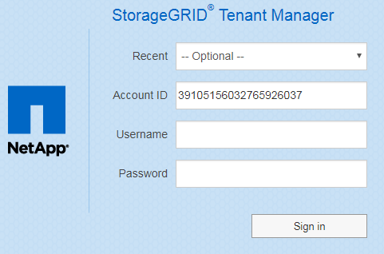

= Tenant Manager にサインインします
:icons: font
:imagesdir: ../media/

[role="lead"]
Tenant Manager にアクセスするには、のアドレスバーにテナントの URL を入力します xref:../admin/web-browser-requirements.adoc[サポートされている Web ブラウザ]。

.必要なもの
* ログインクレデンシャルが必要です。
* Grid 管理者から提供された Tenant Manager にアクセスするための URL を用意しておく必要があります。URL は次のいずれかの例のようになります。
+
[listing]
----
https://FQDN_or_Admin_Node_IP/
----
+
[listing]
----
https://FQDN_or_Admin_Node_IP:port/
----
+
[listing]
----
https://FQDN_or_Admin_Node_IP/?accountId=20-digit-account-id
----
+
[listing]
----
https://FQDN_or_Admin_Node_IP:port/?accountId=20-digit-account-id
----
+
URL には、管理ノードへのアクセスに使用される完全修飾ドメイン名（ FQDN ）または IP アドレスが必ず含まれ、オプションでポート番号、 20 桁のテナントアカウント ID 、またはその両方が追加されます。

* URL に 20 桁のテナントアカウント ID が含まれていない場合は、このアカウント ID を確認しておく必要があります。
* を使用している必要があります xref:../admin/web-browser-requirements.adoc[サポートされている Web ブラウザ]。
* Web ブラウザでクッキーが有効になっている必要があります。
* 特定のアクセス権限が必要です。

.手順
. を起動します xref:../admin/web-browser-requirements.adoc[サポートされている Web ブラウザ]。
. ブラウザのアドレスバーに、 Tenant Manager にアクセスするための URL を入力します。
. セキュリティアラートが表示された場合は、ブラウザのインストールウィザードを使用して証明書をインストールします。
. Tenant Manager にサインインします。
+
表示されるサインイン画面は、入力した URL と、組織がシングルサインオン（ SSO ）を使用しているかどうかによって異なります。次のいずれかの画面が表示されます。

+
** Grid Manager のサインインページが表示されます。右上の * Tenant Login * リンクをクリックします。
+
image::../media/tenant_login_link.gif[Grid Manager のサインインページのテナントログインリンク]

** Tenant Manager のサインインページが表示されます。以下に示すように、「 * アカウント ID * 」フィールドはすでに入力されている可能性があります。
+

+
... テナントの 20 桁のアカウント ID が表示されない場合は、最近のアカウントのリストにテナントアカウントが表示されている場合はその名前を選択するか、アカウント ID を入力します。
... ユーザ名とパスワードを入力します。
... [ * サインイン * ] をクリックします。
+
Tenant Manager のダッシュボードが表示されます。

** グリッドで SSO が有効になっている場合は、組織の SSO ページ。例：
+
image::../media/sso_organization_page.gif[SSO の組織のサインインページの例]

+
標準の SSO クレデンシャルを入力し、 * サインイン * をクリックします。

** Tenant Manager の SSO サインインページ。
+
image::../media/sign_in_sso.gif[SSO が有効な場合はテナントアカウントにサインインします]

+
... テナントの 20 桁のアカウント ID が表示されない場合は、最近のアカウントのリストにテナントアカウントが表示されている場合はその名前を選択するか、アカウント ID を入力します。
... [ * サインイン * ] をクリックします。
... 組織の SSO サインインページで通常使用している SSO クレデンシャルを使用してサインインします。
+
Tenant Manager のダッシュボードが表示されます。

. 他のユーザーから初期パスワードを受け取った場合は、アカウントを保護するためにパスワードを変更してください。[*_username_*>*Change Password*] を選択します。
+

NOTE: StorageGRID システムで SSO が有効になっている場合は、テナントマネージャからパスワードを変更できません。

