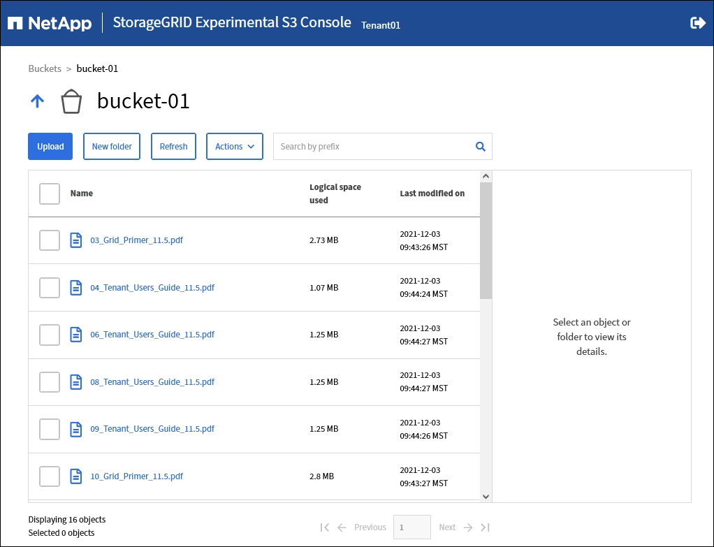

= Experimental S3 Console を使用します
:allow-uri-read: 
:icons: font
:imagesdir: ../media/

[role="lead"]
S3 コンソールを使用して S3 バケット内のオブジェクトを表示できます。

S3 コンソールを使用して、次の操作を実行することもできます。

* オブジェクト、オブジェクトバージョン、およびフォルダの追加と削除
* オブジェクトの名前を変更する
* バケットとフォルダ間でオブジェクトを移動およびコピーする
* オブジェクトタグを管理します
* オブジェクトのメタデータを表示します
* オブジェクトをダウンロードします

NOTE: S3 コンソールは完全にテストされておらず、「 experimental 」としてマークされています。 オブジェクトの一括管理や本番環境での使用は対象外です。テナントで S3 コンソールを使用するのは、オブジェクトをアップロードして新しい ILM ポリシーをシミュレートするとき、取り込みの問題をトラブルシューティングするとき、コンセプトの実証（ POC ）グリッドや非本番環境のグリッドを使用するときなど、少数のオブジェクトに対して機能を実行する場合のみにしてください。

.必要なもの
* Tenant Manager にはを使用してサインインします xref:../admin/web-browser-requirements.adoc[サポートされている Web ブラウザ]。
* Manage Your Own S3 Credentials 権限が設定されます。
* バケットを作成しておきます。
* ユーザのアクセスキー ID とシークレットアクセスキーを確認しておきます。オプションで ' この情報を含む '.csv ファイルがありますを参照してください xref:creating-your-own-s3-access-keys.adoc[アクセスキーの作成手順]。

.手順
. [ * バケット * ] を選択します。
. 選択するオプション image:../media/s3_console_link.png["S3 コンソールのリンク"]。このリンクには、バケットの詳細ページからもアクセスできます。
. Experimental S3 Console のサインインページで、アクセスキー ID とシークレットアクセスキーをフィールドに貼り付けます。それ以外の場合は、 [Upload access keys] を選択し、 [.csv] ファイルを選択します。
. 「サインイン」を選択します。
. 必要に応じてオブジェクトを管理します。

