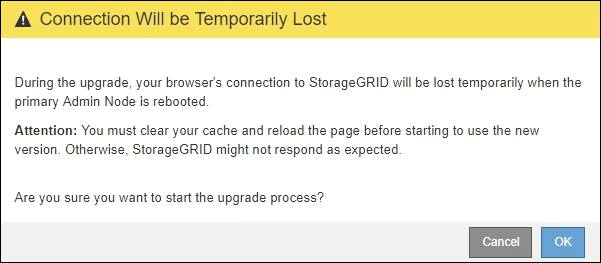

= アップグレードを実行する
:allow-uri-read: 
:icons: font
:imagesdir: ../media/

[role="lead"]
アップグレードを実行する準備ができたら '`.upgrade] アーカイブを選択し ' プロビジョニング・パスフレーズを入力しますオプションとして、実際のアップグレードを実行する前にアップグレードの事前確認を実行することもできます。

.必要なもの
すべての考慮事項を確認し、計画と準備の手順をすべて完了しておきます。

== アップグレードファイルをアップロードします

. を使用して Grid Manager にサインインします xref:../admin/web-browser-requirements.adoc[サポートされている Web ブラウザ]。
. [* Maintenance * （メンテナンス） ] > [* System * （ * システム * ） ] > [* Software Update * （ソフトウェア・アップデート
+
Software Update ページが表示されます。

. StorageGRID アップグレード * を選択します。
. StorageGRID アップグレード・ページで ' アップグレード・アーカイブを選択します
+
.. [ * 参照 * ] を選択します。
.. 「 NetApp_StorageGRIDWeb_11.0.0_Software_uniqueID.upgrade 」というファイルを探して選択します
.. 「 * 開く * 」を選択します。
+
ファイルがアップロードされて検証されます。検証プロセスが完了したら、アップグレードファイル名の横に緑のチェックマークが表示されます。

. プロビジョニングパスフレーズをテキストボックスに入力します。
+
Run PreChecks * ボタンと * Start Upgrade * ボタンが有効になります。

+
image::../media/storagegrid_upgrade_buttons_enabled.png[StorageGRID アップグレードボタンが有効です]

== 事前確認を実行

必要に応じて、実際のアップグレードを開始する前にシステムの状態を検証できます。[Run Prechecks] を選択すると、アップグレードを開始する前に問題を検出して解決できます。アップグレードを開始した場合も、同じ事前確認が実行されます。事前確認が失敗すると、アップグレードプロセスが停止し、解決のためにテクニカルサポートの支援が必要になる場合があります。

. 「 * 事前チェックを実行 * 」を選択します。
. 事前確認が完了するまで待ちます。
. 事前確認で報告されたエラーを解決するための手順に従います。
+

IMPORTANT: カスタムのファイアウォールポートが開いている場合は、事前確認の実行中に通知されます。アップグレードを続行する前に、テクニカルサポートに連絡する必要があります。

== アップグレードを開始し、プライマリ管理ノードを更新します

アップグレードを開始すると、アップグレードの事前確認が実行され、プライマリ管理ノードがアップグレードされます。これには、サービスの停止、ソフトウェアのアップグレード、サービスの再開が含まれます。プライマリ管理ノードのアップグレード中は Grid Manager にアクセスできません。監査ログも使用できなくなります。このアップグレードには最大 30 分かかることがあります。

. アップグレードを実行する準備ができたら、 * アップグレードを開始 * を選択します。
+
プライマリ管理ノードのリブート時にブラウザの接続が失われることを通知する警告が表示されます。

+

. 警告を確認してアップグレードプロセスを開始するには、「 * OK 」を選択します。
. アップグレードの事前確認が実行され、プライマリ管理ノードがアップグレードされるまで待ちます。
+

NOTE: 事前確認のエラーが報告された場合は、それらを解決し、 * アップグレードの開始 * を再度選択します。

+
プライマリ管理ノードのアップグレード中に、「 Service Unavailable 」 * と「 Problem connecting to the server * 」というメッセージが複数表示されるので、無視してかまいません。

+
image::../media/software_upgrade_503_error.png[ソフトウェアアップグレード 503 エラー]

+
image::../media/software_upgrade_problem_connecting_error.png[ソフトウェアアップグレードの問題接続エラー]

. 「 *400 ： Bad Request * 」というメッセージが表示されたら、次の手順に進みます。これで管理ノードのアップグレードは完了です。
+
image::../media/software_upgrade_400_error.png[ソフトウェアアップグレード 400 エラー]

== ブラウザキャッシュをクリアして、再度サインインします

. プライマリ管理ノードをアップグレードしたら、 Web ブラウザのキャッシュをクリアして再度サインインします。
+
手順については、 Web ブラウザのドキュメントを参照してください。

+

IMPORTANT: Web ブラウザのキャッシュをクリアするのは、前のバージョンのソフトウェアで使用していた古いリソースを削除するためです。

+
再設計された Grid Manager インターフェイスが表示され、プライマリ管理ノードがアップグレードされたことが示されます。

+
image::../media/grid_manager_dashboard.png[Grid Manager ダッシュボード]

. サイドバーから「 * maintenance * 」（メンテナンス * ）を選択して、メンテナンスメニューを開きます。
. 「 * システム」セクションで、「 * ソフトウェア・アップデート * 」を選択します。
. StorageGRID アップグレード * セクションで、 * アップグレード * を選択します。
. StorageGRID アップグレードページのアップグレードの進行状況セクションを確認します。このセクションには、各メジャーアップグレードタスクに関する情報が記載されています。
+
.. * アップグレード・サービスの開始 * が最初のアップグレード・タスクですこのタスクでは、ソフトウェアファイルがグリッドノードに配信され、アップグレードサービスが開始されます。
.. * Start Upgrade Service * タスクが完了すると、 * Upgrade Grid Nodes * タスクが開始されます。
.. * Upgrade Grid Nodes * タスクの実行中は、 Grid Node Status テーブルが表示され、システム内の各グリッドノードのアップグレードステージが示されます。

== リカバリパッケージをダウンロードして、すべてのグリッドノードをアップグレードします

. グリッドノードがグリッドノードステータステーブルに表示されたあと、グリッドノードを承認する前に、 xref:obtaining-required-materials-for-software-upgrade.adoc#download-the-recovery-package[リカバリパッケージの新しいコピーをダウンロードします]。
+

IMPORTANT: プライマリ管理ノードでソフトウェアバージョンをアップグレードしたあとで、リカバリパッケージファイルの新しいコピーをダウンロードする必要があります。リカバリパッケージファイルは、障害が発生した場合にシステムをリストアするために使用します。

. Grid Node Status テーブルの情報を確認します。グリッドノードは、管理ノード、 API ゲートウェイノード、ストレージノード、およびアーカイブノードの各セクションに分類されています。
+
image::../media/software_upgrade_start_grid_node_status.png[管理ノードの完了後の Grid ノードのアップグレードのスクリーンショット]

+
このページが最初に表示されたとき、グリッドノードは次のいずれかの段階にあります。

+
** Done （プライマリ管理ノードのみ）
** アップグレードを準備中
** ソフトウェアのダウンロードがキューに登録され
** ダウンロード中です
** 承認待ちです

. アップグレードキューに追加する準備ができたグリッドノードを承認します。
+

IMPORTANT: グリッドノードでアップグレードを開始すると、そのノードのサービスは停止します。グリッドノードはあとでリブートされます。ノードと通信しているクライアントアプリケーションでサービスの中断を回避するために、ノードを停止およびリブートして問題ないことを確認するまでは、ノードのアップグレードを承認しないでください。必要に応じて、メンテナンス時間をスケジュールするか、お客様に通知します。

+
StorageGRID システムではすべてのグリッドノードをアップグレードする必要がありますが、アップグレード順序はカスタマイズできます。個々のグリッドノード、グリッドノードのグループ、またはすべてのグリッドノードを承認できます。

+
ノードのアップグレード順序が重要な場合は、ノードまたはノードグループを 1 つずつ承認し、各ノードでアップグレードが完了するまで待ってから、次のノードまたはノードグループを承認します。

+
** 1 つまたは複数の * 承認 * ボタンを選択して、アップグレードキューに 1 つまたは複数のノードを追加します。同じタイプの複数のノードを承認すると、ノードは一度に 1 つずつアップグレードされます。
** 各セクション内の * すべて承認 * ボタンを選択して、同じタイプのすべてのノードをアップグレードキューに追加します。
** グリッド内のすべてのノードをアップグレードキューに追加するには、最上位の * すべて承認 * ボタンを選択します。
** ノードまたはすべてのノードをアップグレードキューから削除するには、「 * Remove * 」または「 * Remove All * 」を選択します。ステージが * Stopping services * になっているときは、ノードを削除できません。[ * 削除（ * Remove ） ] ボタンが非表示になります。
+
image::../media/software_upgrade_two_nodes_queued.png[Stage がサービスを停止していることを示すスクリーンショット]

. 各ノードのアップグレード段階の処理が終わるまで待ちます。これには、 Queued 、 Stopping services 、 Stopping container 、 Cleaning up Docker images 、 Upgrading base OS packages 、 rebooting 、 performing steps after reboot 、 starting services 、 done が含まれます。
+

NOTE: アプライアンスノードの Upgrading base OS packages ステージに達すると、アプライアンス上の StorageGRID アプライアンスインストーラソフトウェアが更新されます。この自動プロセスにより、 StorageGRID アプライアンスインストーラのバージョンが StorageGRID ソフトウェアのバージョンと常に同期された状態になります。

== アップグレードを完了する

すべてのグリッドノードのアップグレードステージが完了すると、「 Upgrade Grid Nodes * 」タスクが完了と表示されます。残りのアップグレードタスクは自動的にバックグラウンドで実行されます。

. 機能の有効化 * タスクが完了するとすぐに（すぐに実行されます）、アップグレードされた StorageGRID バージョンの新機能の使用を任意で開始します。
. データベースのアップグレード * タスクでは、アップグレードプロセスによって各ノードがチェックされ、 Cassandra データベースの更新が不要であることが確認されます。
+

NOTE: StorageGRID 11.5 から 11.6 へのアップグレードでは、 Cassandra データベースをアップグレードする必要はありません。ただし、各ストレージノードの Cassandra サービスは停止したあとに再起動します。StorageGRID の今後の機能リリースでは、 Cassandra データベースの更新処理が完了するまでに数日かかることがあります。

. データベースのアップグレード * タスクが完了したら、 * 最終アップグレード手順 * タスクが完了するまで数分待ちます。
+
最終アップグレード手順タスクが完了すると、アップグレードが完了します。

== アップグレードを確認

. アップグレードが正常に完了したことを確認します。
+
.. Grid Manager の上部からヘルプアイコンを選択し、 * バージョン情報 * を選択します。
.. 表示されたバージョンが想定どおりであることを確認します。
.. 「 * maintenance * > * System * > * Software update * 」を選択します。
.. StorageGRID upgrade * （アップグレードのアップグレード）セクションで、 * Upgrade * （アップグレード * ）を選択します。
.. 緑のバナーが表示されていて、ソフトウェアのアップグレードが予定の日時に完了していることを確認します。
+
image::../media/software_upgrade_done.png[ソフトウェアアップグレードが完了しました]

. StorageGRID のアップグレードページで、現在の StorageGRID バージョンに使用できるホットフィックスの有無を確認します。
+

NOTE: 更新パスが表示されない場合は、ブラウザからネットアップサポートサイトにアクセスできない可能性があります。または、 AutoSupport ページ（ * support * > * Tools * > * AutoSupport * ）の * Check for software updates * チェックボックスが無効になっている可能性があります。

. ホットフィックスがある場合は、ファイルをダウンロードします。次に、を使用します xref:../maintain/storagegrid-hotfix-procedure.adoc[StorageGRID ホットフィックス手順] ホットフィックスを適用する方法。
. グリッドの動作が正常に戻っていることを確認します。
+
.. サービスが正常に動作していること、および予期しないアラートが発生していないことを確認してください。
.. StorageGRID システムへのクライアント接続が想定どおり動作していることを確認する。

